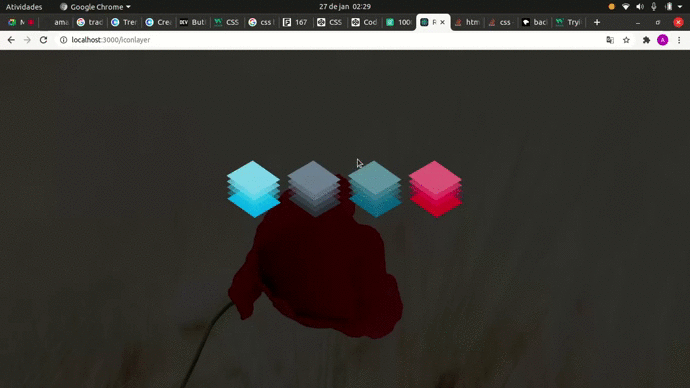
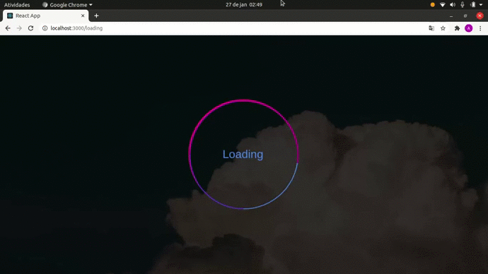
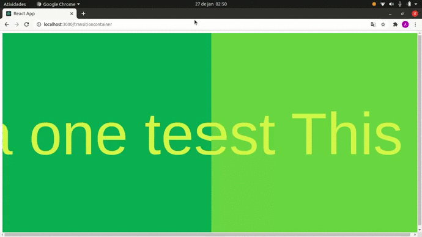
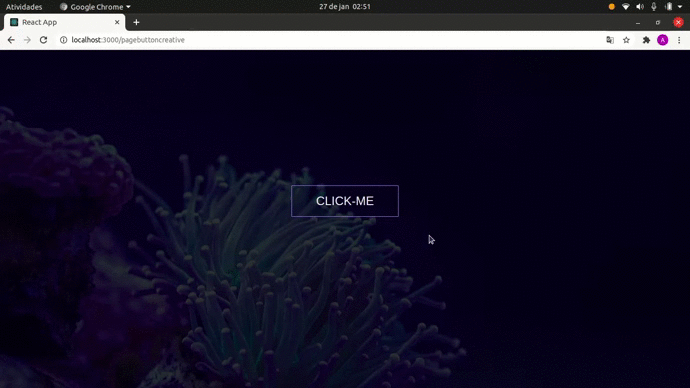

## Descrição do Projeto / Project description

 PT: Utilizando Styled Components, em simples aplicações (Insipiração para o desenvolvimento desses componentes: https://github.com/MilenaCarecho/30diasDeCSS) 

 EN: Using Styled Components, in simple applications (Insipiration for the development of these components: https://github.com/MilenaCarecho/30diasDeCSS) 

### Demonstração/ Demonstration: 

Button Layer

</img>
 

Loading

</img>
 

Text transition

</img>
 

Button Creative

</img>

